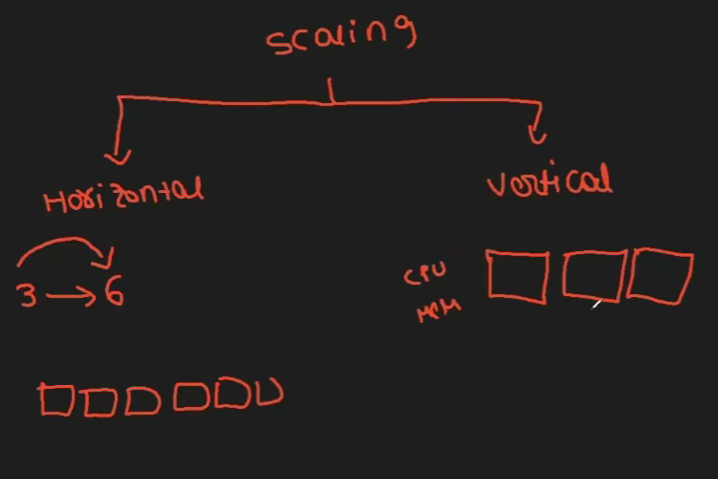
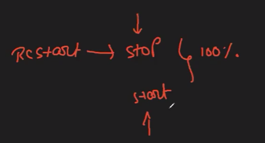
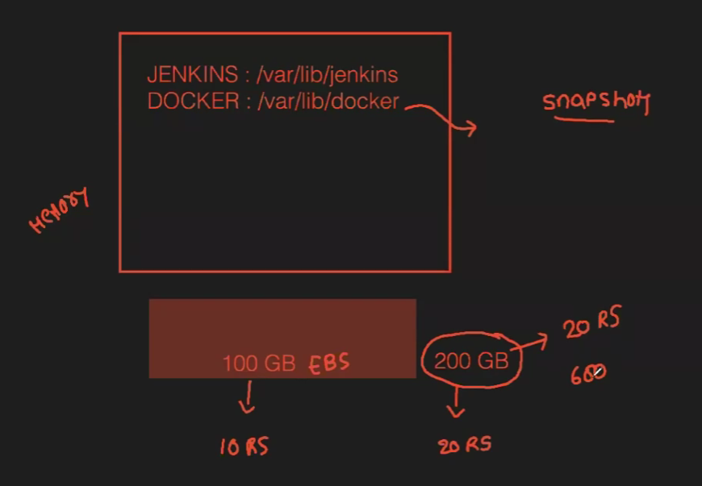
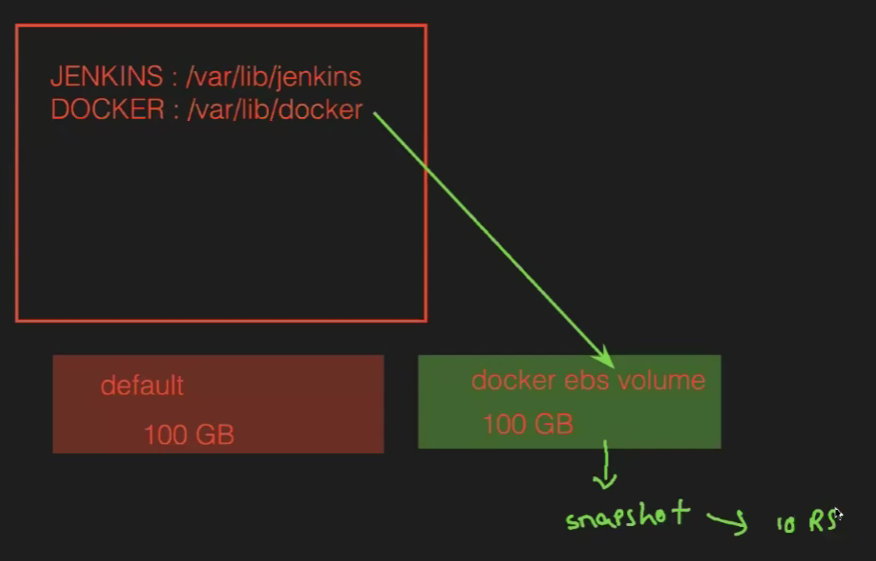
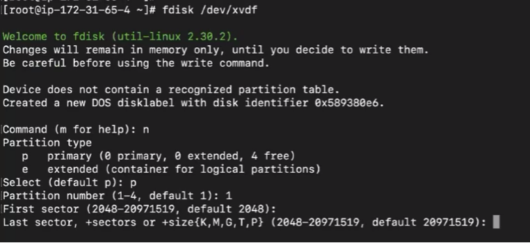

Extra Topics:

Scaling : 2 types
1. Horizontal Scaling --> Incresing the containers
2. Vertical Scaling --> increseing the CPU & Memory

docker run -itd --name cont1 --port 1111:80 --cpus=0.25 --memory=10M nginx
docker update --cpus=0.5 --memory=20M cont1

To check CPU and Memory utilization of container:
To get all container -->docker stats
To specific container --> docker stats cont1
To stop it ---> CTRL+C

To know the changes done in container:(C--> Change A--> add D--> delete):
To know specific container -->docker diff cont1

We can also create an image from a container:
Goto an container --> docker exec -it cont3 bash
Update --> apt update -y
Git install --> apt install git -y
Vim install --> apt install vim -y
create a files ---> touch phani{1..3}
we made changes in container we can create an image from this container it will have all the data...

To geneate image -->docker commit cont3 image11(cont3- which container | image11--> image name)
We will recive the image ID from that create a new contianer we can get all the data from previous container data:
docker run -itd --name cont4 ImageName or ID
Goto container inside --> docker exec -it cont4 bash

How to send the file from server to container:
docker cp index.html cont2:/usr/share/nginx/html
(index.html is the file which we need to send and next is cont2 path to where it should be sended)

To get files from container to server:
docker cp cont5:/phani* .
(cont5 /phani is the path where files are there all those files need to come to current dir of server)

To monitor the entire host:
docker system df  (it will show the data of images, contianers, local volumes, memory)

Contianer restart Policy:

if we restart the docker then it will stop all the containers --> then we need to start the containers again manually so we need to use policy -->not to stop  the restart policy need to give at container creation
docker run -itd --name contName --restart=always nginx

If any container stops then it should be removed
docker run -itd --rm --name contName nginx

To delete all the dangling images --> docker image prune
To delete unused images --> docker image prune -a

To know all the images, volume, network in system --> docker events

Senario:

Solution:

Process:
Need to know EBS volumes --> lsblk
Know the storgae volume by seeing in AWS
To add volume it should be in same AVAILABLE ZONE
Create a volume from same zone
goto volumes--> refresh --> if it is avaible --> attach --> select instance --> devince name (/dev/xvdf)--> attach volume
check with fdisk -l we can also see in AWS
Need to mount --> fdisk /dev/xvdf

check above factors
goto --> vi /etc/fstab
Need to add path in it --> /dev/xvdf1 /var/lib/docker/ ext4 defaults 0 0
make file system --> mkfs.ext4 /dev/xvdf1
Now need to mount -->mount -a
Check --> df -h (we can see our device)
Now pull images to check where it is getting pulled: docker pull sonarqube:lts-communnity

