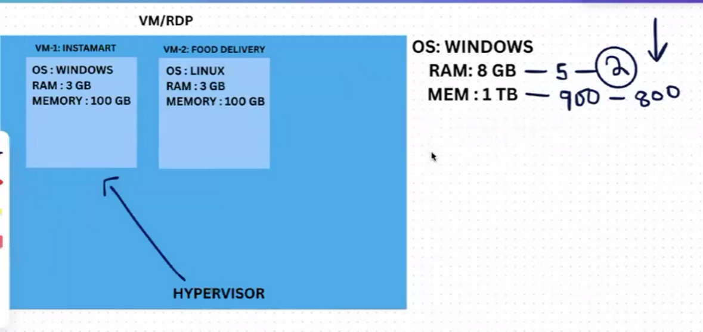
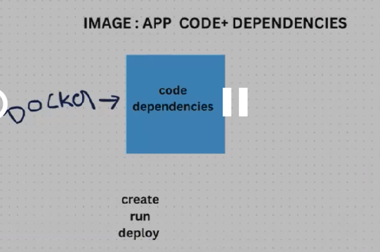
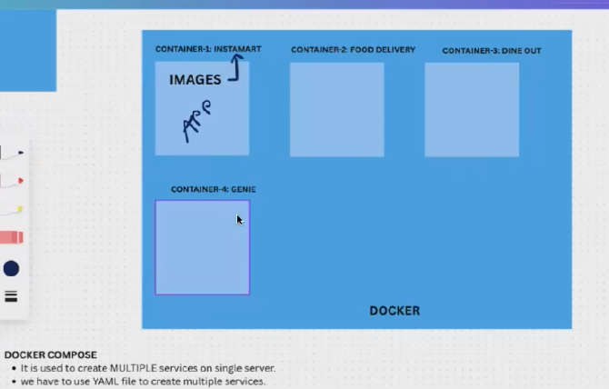
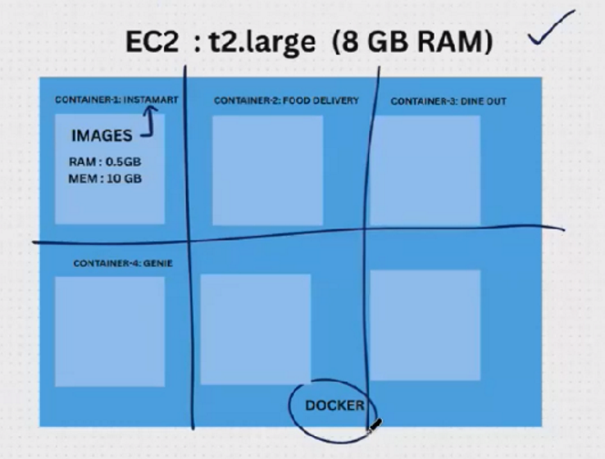
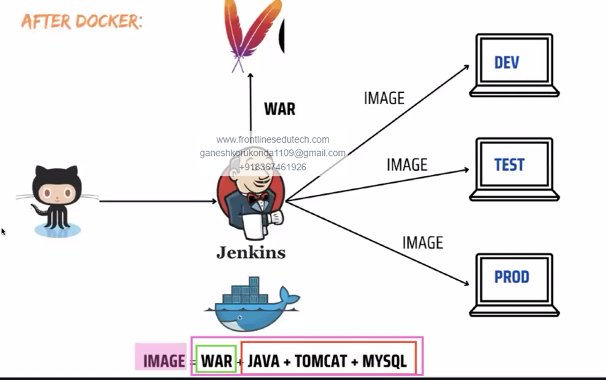
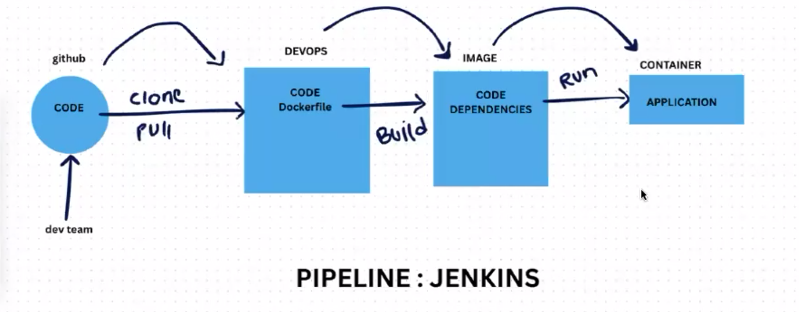
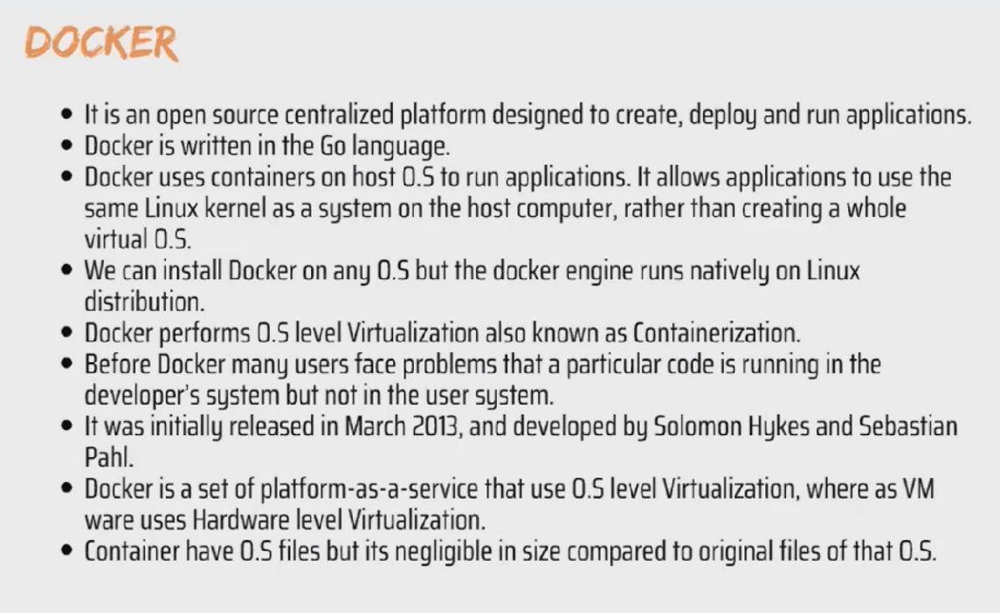
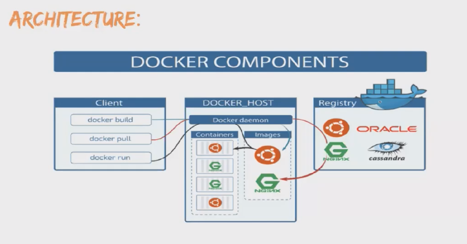
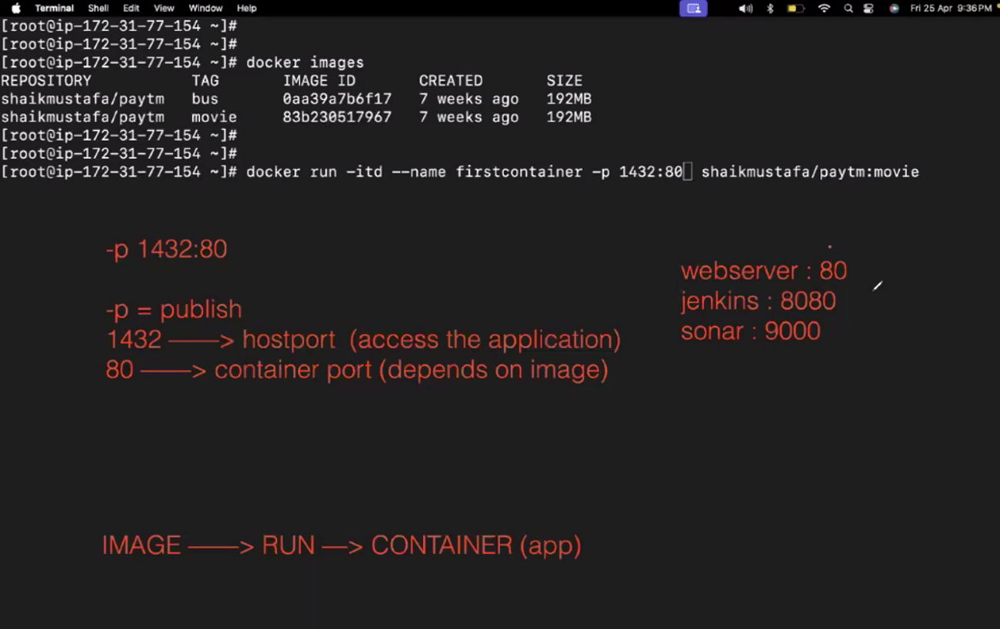

IMAGE--> Application Code + Dependencies

DOCKER CLIENT: It is the place where we run the docker commands
DOCKER HOST: where we install the docker
Docker Client  & Host will be in same server

GIT(code) --> GitHub(store & share)
DOCKER(images)---> DockerHub(store & share)
DockerHub is the default registry

Install docker --> yum install docker -y
Start --> systemctl start docker

Creating Images:
To check the images in instances -->Docker images
To download images --> docker pull name/paytm:bus

IMAGE ---> RUN ---> CONTAINER(APP)

Create container:
Create container---> Docker run -itd --name  firstcontainer -p 1432:80  name/paytm:bus
docker run -itd -p 1111:80 --name firstcontainer shaikmustafa/paytm:movie

To know container created or not --> docker ps

To stop container ---> docker stop ContanierName
To start container --> docker start containerName

We need to change the container port number & name from one container to another eg: 1432 or anything

