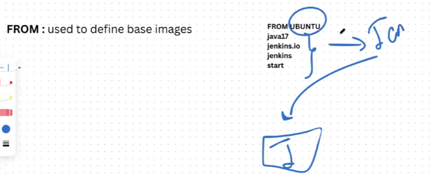
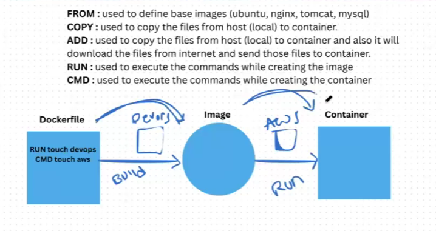
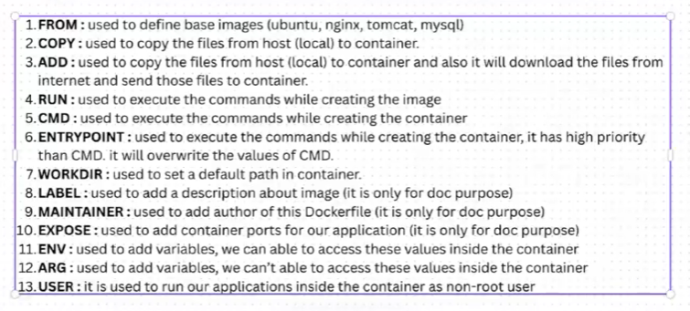

To just create a container no need to give portnumber if you need to deploy then  need to have portno to access the application 

To delete a container --> docker rm container1 name

To stop all containers ---> docker stop $(docker ps)
To start all containers ---> docker start $(docker ps -a)

We can't delete a container when its in running state need to stop and delete it. Or we need to remove it forcefully  

To remove image ---> docker rmi nginx:latest
To remove all images ---> docker rmi $(docker images)

To get container full information: docker inspect containerName or ID

To create image on our own:
Docker File:
Its is text based file which contains a set of instructions.
It helps to automate the docker image creation

FROM: used to define base images

How to go into container --> docker exec -it cont1(name) bash
