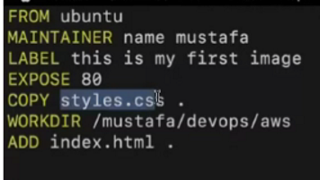
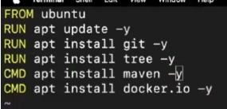
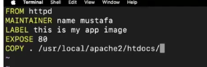
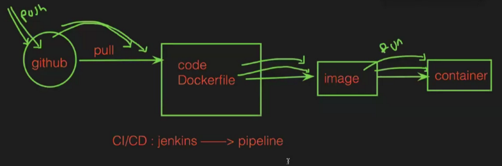
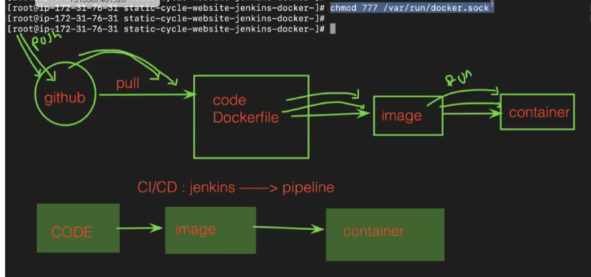
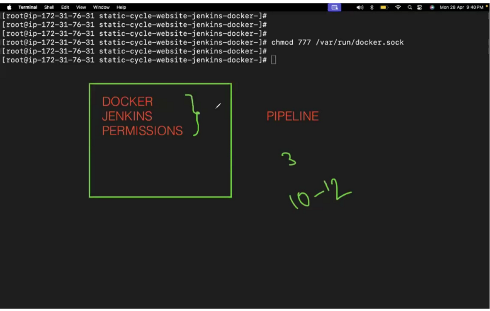

Created a Instance named docker
installed docker in  it and started docker

Creating docker file with name ---> Dockerfile
Create file --> Vim Dockerfile

Steps:

From ---> it defines base image
MAINTAINER ---> user to add author details
LABEL --> user to add description 
EXPOSE --> To give port number
COPY --> index.html /opt  (ndex.html is in our source and /opt is destination given to copy)

To build the image to this file ---> 
Docker build -t flm:vi .

From the image we need to create a container-->
docker run -itd --name container1 phani:v1

execute the container --> docker exec -it f6e48f10dd8e bash

Then goto the container we can see the file in opt folder

Example:copying files from instance to docker container
FROM ubuntu
MAINTAINER name raju
LABEL This is my image
EXPOSE 80
COPY index.html /opt/

Also create a index file then try to build image using file

Eg2:  copying files from instance to docker container using ADD
FROM ubuntu
MAINTAINER name raju
LABEL This is my image
EXPOSE 80
ADD . .

Eg3: we can download files using ADD 
FROM ubuntu
MAINTAINER name raju
LABEL This is my image
EXPOSE 80
ADD https://downloads.apache.org/tomcat/tomcat-11/v11.0.11/bin/apache-tomcat-11.0.11.tar.gz  /etc/

Eg4:

Style.css file will copy to container in default place which is /
Wkdir make the file path deafult in conatiner 
Now the index file will  be added in the above path in container which is default 

Eg5: RUN cmd
FROM ubuntu
RUN apt update -y
RUN apt install git -y
CMD apt install maven -y

Eg6:

We can use so many RUN in one docker file but we cant use multiple CMD  in one docker file
Only latest CMD will execute

Eg7: EVN & ARG
Need to use --> printenv or printenv | grep -i "course"
If we use ENV we can see them in container but for ARG we can't 

To delete all images --> docker rmi $(docker images)

To write docker file for application:HTTPD
Install git
Clone the link
Create docker file

And then build image--> docker build -t myapp .
Build container --> docker run -itd --name cont1 -p 1111:80 myapp
Then take ip of instance and give port number ip:1111

Scenario: 

To not get error at stage 2 give that command  chmod 

