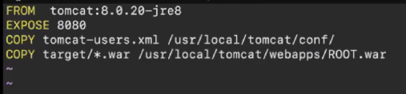

FOR NGINX
Git link --> digital marketing 
Dockerfile:

Docker build -t myapp .
Docker images
Docker run -itd --name cont1 -p 1111:80 myapp
Copy publicid and access with port number

FOR JAVA
Git link --> one file
for java take master --> only keep pom.xml & src file
Install java-17 
Do all the thinks to install maven latest version
To build source code --> mvn clean package
If build success then you need to get target folder in one folder
Goto target folder you can see war file 
Now create docker file
Docker file:

Docker build -t javaapp
Docker run -itd --name cont2 -p 2222:8080
Copy pb id and portnumber
To change credentials: create a tomcat-users.xml file and paste 
Now need to send to container --> COPY cmd

Again build image and container 
But need to change /myapp at root.war file

FOR NODE.JS
Git link --> node.js docker
Remove docker file
Dockerfile:

Docker build -t nodeapp
Docker run -itd --name cont5  -p 7777:3000 nodeapp
Ip and 5555 access the application 

ALPINE USAGE:
909MB to 177Mb
To reduce image size we use alpine for node to reduce size

DataBase (MySql)
Dockerfile:

Docker build -t dbimage .
Docker run -d --name mydb -p 3306:3306 dbimage
Docker exec -it mydb bash
Mysql -u root -p
Give password: admin@123

To remove none stage images--> docker image prune

