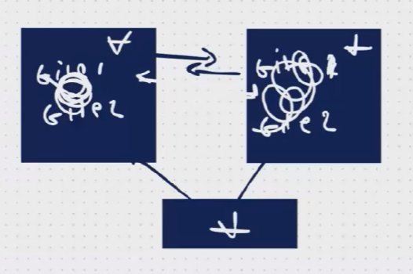
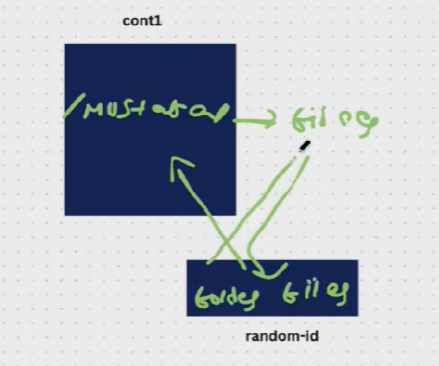

Flow:

DOCKER VOLUMES: volumes are used ti replicate the data b/n multiple containers. 

Create a instance 
Install docker and start docker
Creating container & volume --> docker run -itd --name cont1 -v /phani  ubuntu
List if containers ---> docker ps 
Goto container --> docker exec -it cont1 bash
Use ll

Text :  we created a container and with that one volume is also created and we didn’t give a name it will have a random id 
then the mounting from cont1 /phani is place of we create any files or folders we can get the mounting for folders and files 

From container got to phani folder
Create a files --> touch file{1…3}.ttx
Exit from container 
To see list of volumes --> docker volume ls
Copy volume id which we created before
Goto --> cd /var/lib/docker/
Ll
Goto volumes --> go into that volume --> goto data --> ll --> we can see data

Create files in volume --> touch files{1..4}.pdf
See in container if they created or nnot --> dockeer exec -it cont1 bash
Goto /phani   --> we can see files of pdf
Exit from container

EVEN if we delete the container we can access data from volumes
Volumes are independent from containers
Volume def path ---> /var/lib/docker/vid/_data/

For 2 containers and 1 volume:
Cont1 --> docker run -itd --name cont1 -v /devops ubuntu
Cont2 --> docker run -itd --name cont2 --privileged=true --volumes-from=cont1 ubuntu
goto one containeer --> docker exec -it cont1 bash
Goto devops folder ---> create files or folders
Goto another container --> docker exec -it cont2 bash
Goto devops folder ---> see the list we created
Try to remove files in cont2 and check in cont1

remove the containers ---> docker rm -f cont1 cont2
Docker volume rm vid 

Scenario:
Create a volume and place code in it and will mount the containers to this volume 
Create volume --> docker volume create phani
Goto default path --> cd /var/lib/docker /
Goto volumes --> cd volumes ---> goto data ---> place files lke files{1..3}
Exit
Docker run -itd --name cont1 --mount src=phani,destination=/frontlinesmedia ubuntu 
Docker exec -it cont1 bash ---> we can see the folder created flm
Goto flm --> we can see files 

Just change the cont name and can mount so many containers to one volume 

How to create volume with the docker file:

Docker build -t image1 .
Docker images 
Docker run -itd --name cont6 -p 6666:80 image1 
Access using ip

We can also replicate the data without using volume also as below using that cmd:

Scenario:

Permissions: 

