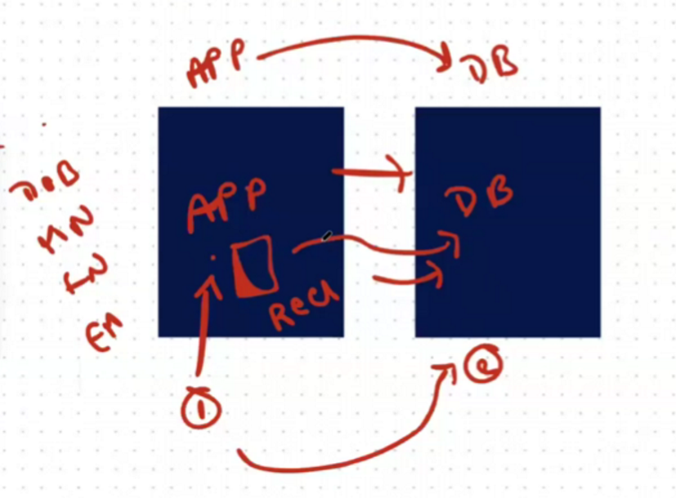

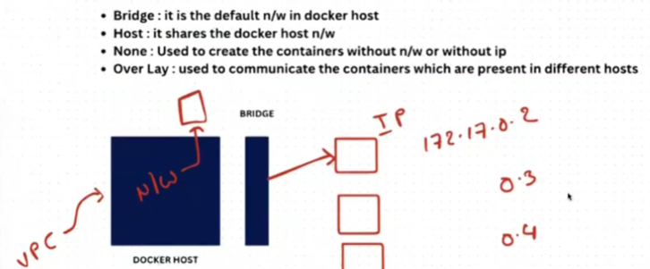

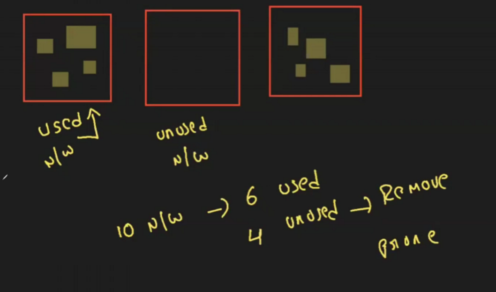

To delete unused containers --> docker network prune

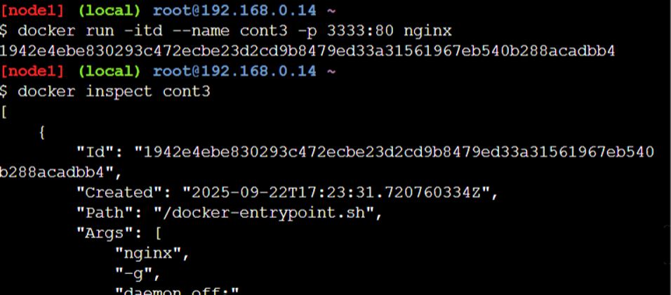

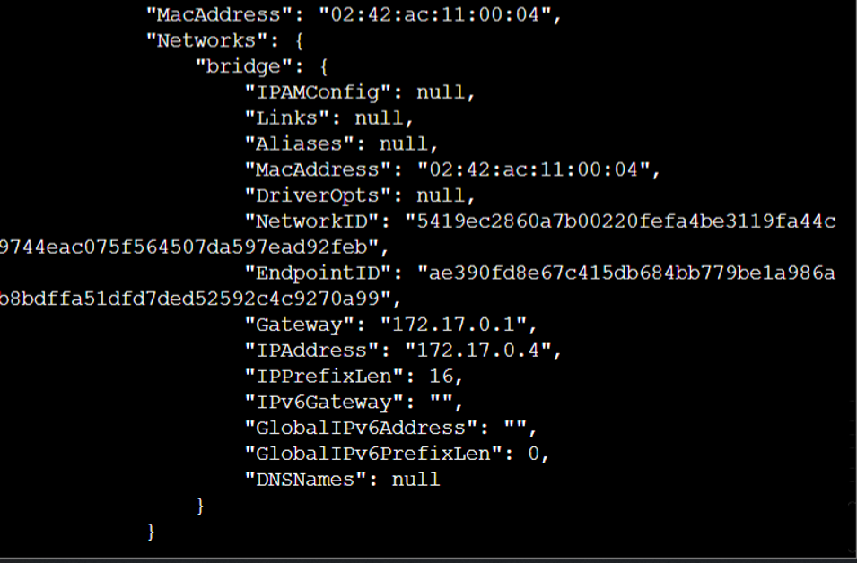

Now we are creating new network:
To create a phani named netowrk
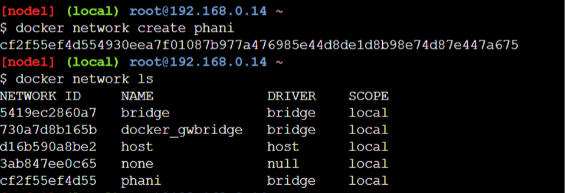

Creating container in that network:
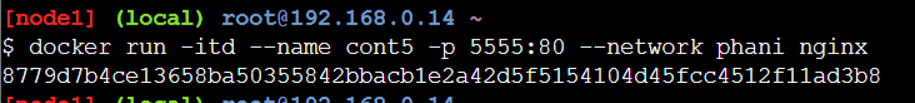

To delete the network :

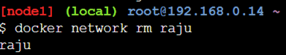

TO check if 2 containers of different networks can communicate:
No it wont work directly  we need to do it manually 
To check we use ping

Create 2 networks and 1 container in each
Then copy the ip of containers
Goto cont1 ---> ping 2nd ip   ---> docker exec -it cont1 bash
Conto cont2 --> ping 1st ip
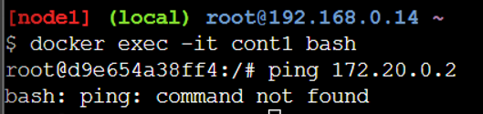

To connect 2 networks :
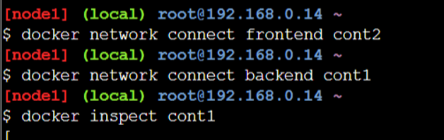

To change port number:
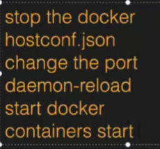

Difference b/n Docker stop and docker kill :
Docker stop --> if we give stop then to docker deamon there will be a signal of SIGTERM due to this the contianer will stop
If we give kill then the signal will be SIGKILL then container will stop

To keep limits for the container:
Docker run -itd ---name cont1 --cpus="0.25" --memory=250m ngnix
To know how much cpu using by container --> dokcer inspect cont1 | grep -i nanocpu

Realtime:

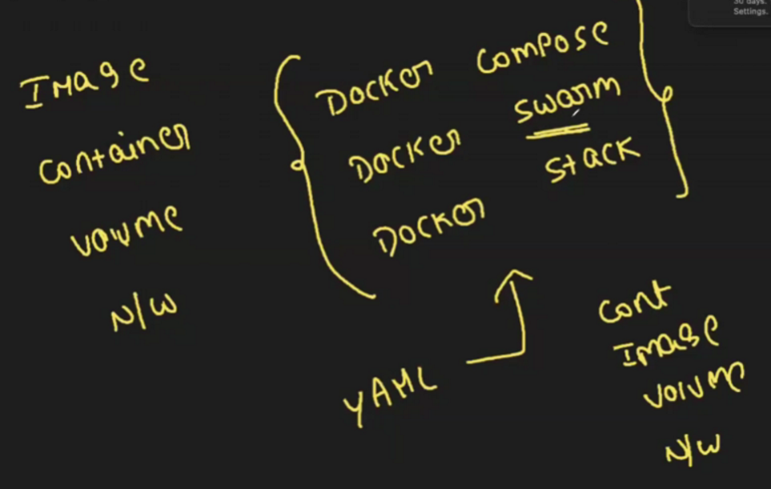
