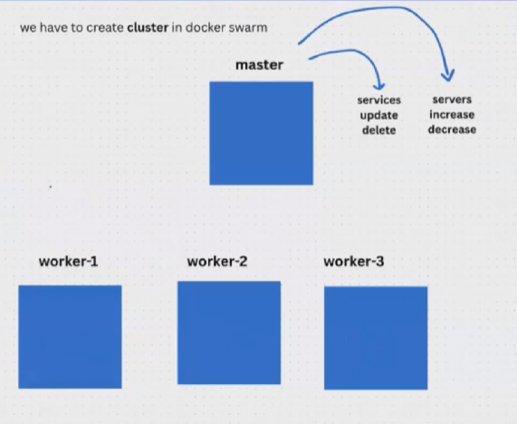
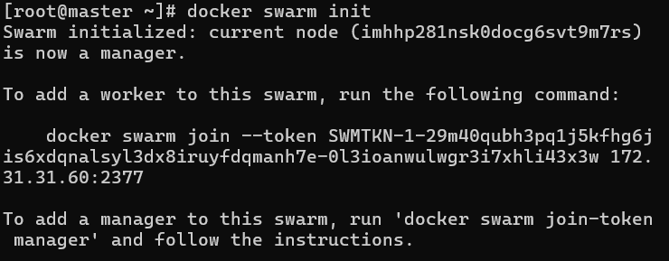
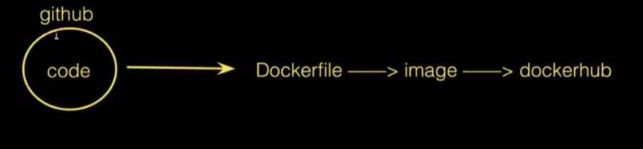

Docker Swarm: It is used to run application on multiple servers.
It is used to create a service(it will create containers)
It has replication and scaling(scale-in & scale-out)
2 types:
1. master node
2. Worker node

We have to create cluster In docker swarm

We can change the host name using ---> hostnamectl set-hostname "master"

Cluster means a group of servers
Now we need to create a cluster 

Goto master run -->  docker swarm init

Now paste the cmd in worker1 and 2 both will join as workers for master 

To check the no of nodes --> docker node ls (it will have master and 2 workers)
Now the creation of cluster is done

Now we need to create a service --> docker service create --name phani --publish 8081:80 --replicas 3 shaikmustafa/paytm:movie 

we can see noof services created --> docker servvice ls

To check which service created in which server-->docker service ps phani

Now we can access webpage using Ip and port number

Now we can delete a container then again a new container will be created

if we delete a service then we cant access any website---> docker service rm phani

To scaleup the container -->docker service scale devops=5

To scale down the nofo containers ---> docker service scale devops=3

To update docker for one webiste to other(upating application) -->
 docker service update --image shaikmustafa/
paytm:movie devops

we can also rollback ---> docker service rollback devops

Remove a Service in Docker Swarm-->docker service rm mustafa

Cluster Maintenance in Docker Swarm:
To remove a node from cluster, go to that worker node and perform the below command---> docker swarm leave
 docker node ls
 docker node rm <node-id>

If you want to add a worker node to our cluster, we need o get a worker node token--> docker swarm join-token worker

If you want to add a manager node to our cluster, we need o get a worker node token--> docker swarm join-token mnager

