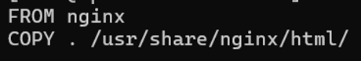
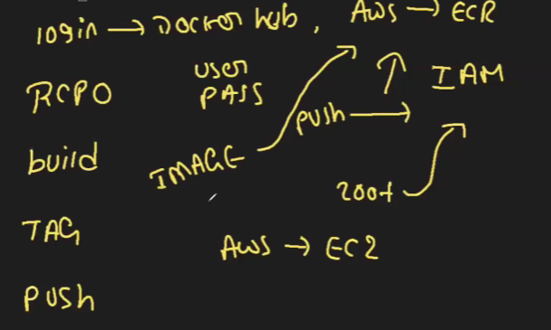

Need to create a instance and install docker in it 
Now need to create a dockerfile and sample indexfile
Dockerfile:

Index.html : any content

Then build the image -->  docker build -t image1 .

To push the image to repo we need to keep image in a syntax:
Format:

We use docker tag--> docker tag image1 kohlivirat/myrepo:v1
now we have the image name on a format to push it to repo :
Use login --> docker login 
Give username and password --> logim
Push the image to repo -->  docker push kohlivirat/myrepo:v1
Done we can see in repo in tags 

How to push to ECR:

Better goto link to know detail doc.
A Beginner's Guide to Docker Registry: What, Why, and How?
