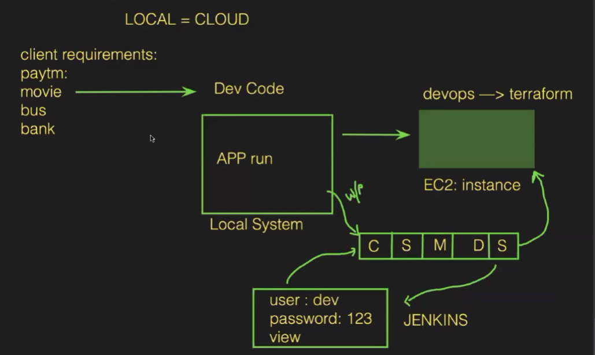
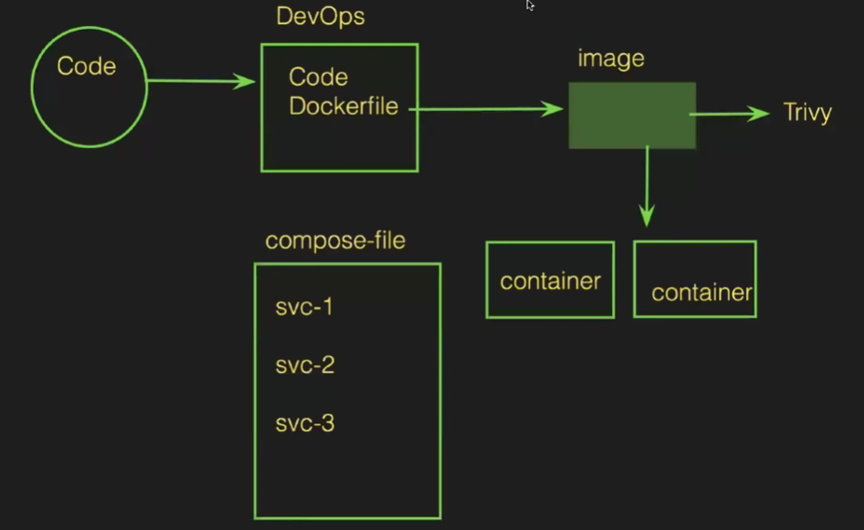

Docker compose: used to run multiple services and run an application on single server

YAML Files:All below things need to implement in yaml file.
services
container-name
image
ports
volumes
networks

Create a instance --> install docker in it and docker compose also --> check once docker-compose version once it is done to verify.....

Now need to write a compose file --> YAML FILE

The yamlfile-->
---
version: "3"                                                services:
  instamart:
    container_name: instamart_container
    image: shaikmustafa/dm
    ports:
      - "8081:80"
 food_delivery:
   container_name: food_container
   image: shaikmustafa/cycle
   ports:
     - "8082:80"
 dineout:
   container_name: dineout_container
   image: shaikmustafa/zomato
   ports:
     - "8083:80"
---

To run the compose file --> docker-compose up -d
Now we can access 3 diff applications from 3 diff port numbers along with IP

Flow of the process:

Dockerization flow:

We now try to test with the local images so follow the process-->
1st need to delete all the images from the docker hub, images and everything 
We also need to remove the images import from the docker hub

Create a 3 folders---> foodapp instamart dineout
the create a file in 1 folder --> index.html, Dockerfile--> 
FROM nginx
COPY . /usr/share/nginx/html/

and copy them to the both the other folders also

Install tree so that graph looks good--> yum install tree -y

Then build the 3 images: 
docker build -t dineout-image dineout/
docker build -t dineout-image instamart/
docker build -t dineout-image foodapp/

Then we need to keep these image names in docker file where we removed it 

then build the dockercompose --> docker-compose up -d

Then you can access the application

If you make any changes in index page or you push any latest code then you need to build again the docker image..... --> docker-compose up -d

Senerio:
But if we have so many applications we cant build evething soooo......
now we delete the images from main compose file ---> need to give the build path of the folder

remove images and containers

now to build images---> docker-compose build(it will build the images by going to the path of No of files services)

To build container --->  docker-compose up -d

If you change code for any 2 application code then you can just build image and container It will build and run the application

To see the containers created by compose --> docker-compose ps
To see images created by compose --> docker-compose images
To delete the containers created by compose --> docker-compose down
To again ccreate  --> docker-compose up -d
To stop --> docker-compose stop
To start -->docker-compose start
To pause --> docker-compose pause
To cinfig--> docker-compose config
To logs --> docker-compose logs

