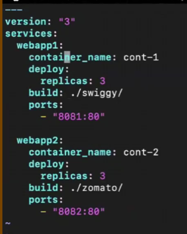
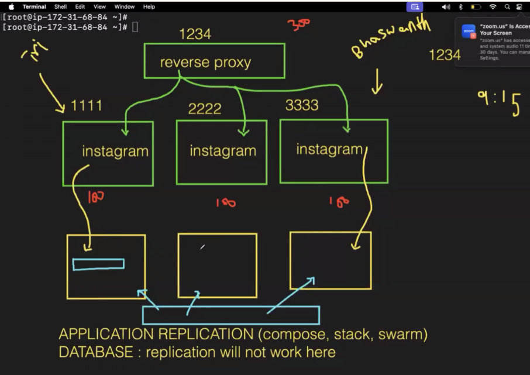
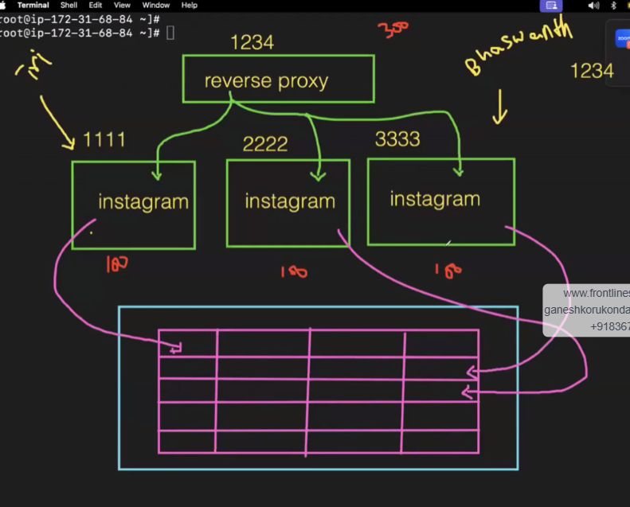

Then if we build replicas then we will have 3 replicas with same name it cant be done remove it so it will create name on own 

now port is also the same for 3 replicas so now remove the port means just eg:8081:80 --> 80 should be there (or) 8081-8083:80

now it will create --> docker-commpose up -d

Then use docker ps --> we can see names and port numbers also

We can give replication only for application replication(compose,stack,swarm)
For database --> replication will not work

Reverse Proxy --> To distribute the load 

we should use single DB to overcome above conflit

