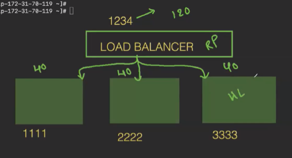

We can use the load balancer to reduce the load and split it equally using the reverse proxy method.
Load balancer is also a container we will give this load balancer container port to access the application. So it will split the load

even after this the load is heavy then we can increse the load up by adding containers when we need

1st down git and docker
then clone the reverse proxy code and clone it
goto the folder and checkout to master to see the code
we dont need docker file can remove it

goto bank folder we can see the code of it and same for mobile also there will be a code 

we also need to create a another container soo we can goto nginx 
open dockerfile --> we can see the content and understand the meaning of it

goto nginx--> niginx.config file we can see the traffic for ports and weight

goto--> the project folder--> and see the compose file to see the build of containers

docker-compose up -d --> it will build 

the copy the public ip and use port pf --> 5001 try to use 5002 you willget the assigned one 
if you try with 8080 then one goes to 1st one goes to 2nd it equally sends the traffic....

